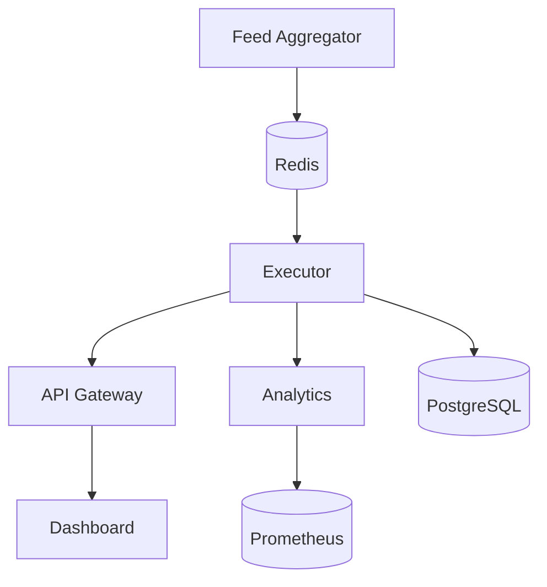

# 🪙 Crypto Arbitrage


---

## Overview

**Crypto Arbitrage** is a multi-agent platform that scans dozens of centralized and decentralized exchanges for price discrepancies and executes low-latency trades. Each service is containerized and communicates through Redis and PostgreSQL while metrics flow to Prometheus and Grafana.

---

## Features

- Real-time order book aggregation across 14 exchanges
- Java executor for sub-60µs trade execution
- REST API with JWT authentication
- React dashboard for live monitoring
- Predictive analytics with optional GPU acceleration
- Alerting and circuit breaking for risk management

---

## Architecture



---

## Setup

1. Start Colima using the Podman runtime:
   ```bash
   colima start --runtime podman
   ```
2. Install dependencies and charts:
   ```bash
   helm dependency update infra/helm
   helm install arb infra/helm
   ```

---

## Envs & Secrets

Environment examples are provided in `api/.env.example` and `analytics/.env.example`. Secrets should be sealed with `kubeseal` before committing. Key variables include:

- `JWT_SECRET` – token signing key
- `PGHOST`, `PGUSER`, `PGPASSWORD`, `PGDATABASE`
- `SENTRY_DSN` for API error reporting
- `VITE_SENTRY_DSN` for dashboard errors

---

## Running Tests

- **Jest** for the dashboard and API:
  ```bash
  npx jest
  ```
- **PyTest** for analytics:
  ```bash
  pytest
  ```
- **Gradle** for the executor:
  ```bash
  ./gradlew test
  ```

---

## Monitoring

- **Sentry** captures runtime exceptions
- **Prometheus** scrapes metrics from all agents
- **StatusCake** monitors uptime of public endpoints

---

## ML Training Pipeline

- **Feature logging**: the Java executor stores trade inputs via `FeatureLogger`.
- **Export**: run `analytics/train/export_features.py` to dump recent rows from
  the `training_features` table as CSV or NumPy files.
- **Model retraining**: execute `analytics/train/retrain.py` to train the
  `SpreadLSTM` model on exported features and log results.
- **Versioning**: models are recorded in the `model_metadata` table for
  reproducibility.
- **Shadow testing**: new models are validated against the live model before
  promotion.
- **Rollback**: use `model_swap.py` to swap to a prior model if issues arise.
- **Scheduling**: `crontab.txt` runs `retrain.py` every Sunday at 2&nbsp;AM.
- **Retrain flow**: features are loaded, the LSTM trains for 10 epochs, and
  validation loss and Sharpe ratio are saved for review.

### AI Lifecycle

- Trade execution → feature log → weekly retrain → scoring → version tag

### Model Registry

- Git-based model archive under `analytics/models/archive`
- SHA256 hash used to track each saved model
- Model audit endpoint: `GET /api/model/version`
- Rollback via `analytics/model_swap.py` with alert notifications

**CLI**

```bash
python analytics/train/retrain.py --epochs 10
python analytics/model_swap.py --version <hash>
```

**API**

```bash
curl http://localhost:3000/api/model/version
```

---

## Deployment

The platform runs on a Xeon host and is orchestrated by Kubernetes. Deploy or upgrade services using Helm charts located in `infra/helm`.

---

## License

Released under the [MIT](LICENSE) license.
