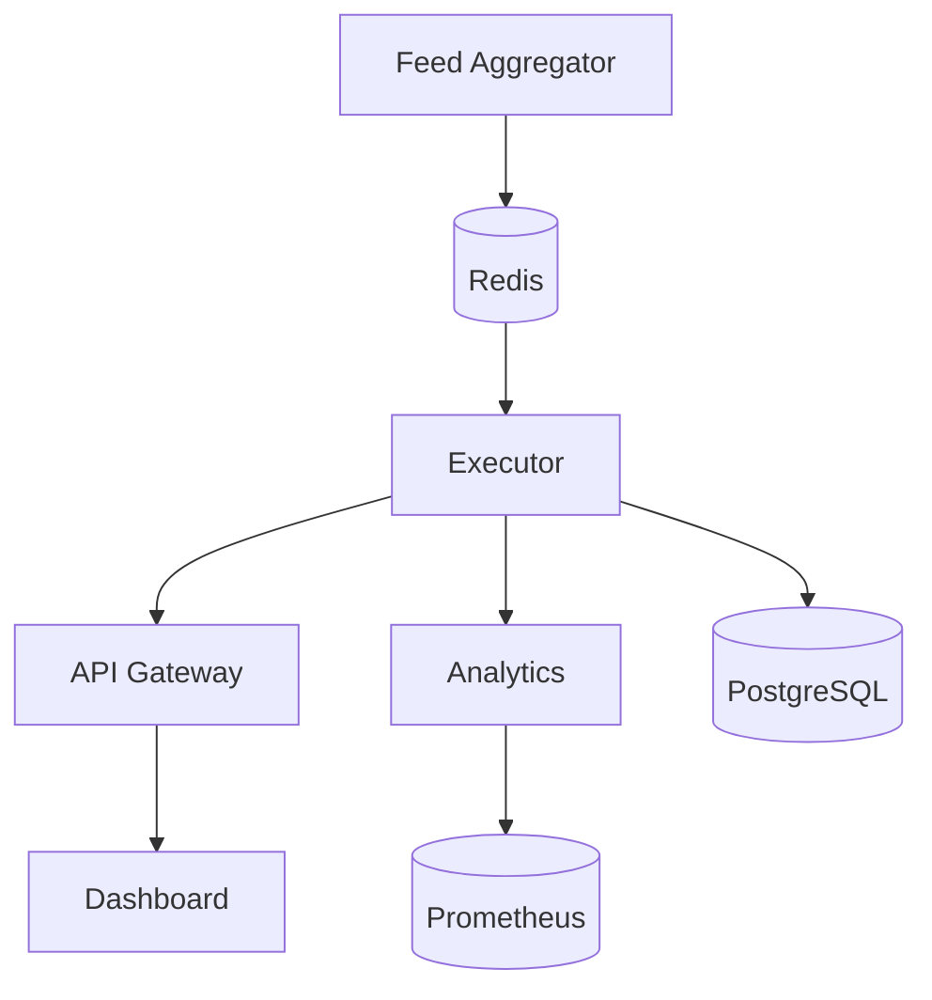

# 🪙 Crypto Arbitrage


---

## Overview

**Crypto Arbitrage** is a multi-agent platform that scans dozens of centralized and decentralized exchanges for price discrepancies and executes low-latency trades. Each service is containerized and communicates through Redis and PostgreSQL while metrics flow to Prometheus and Grafana.

---

## Features

- Real-time order book aggregation across 14 exchanges
- Feed aggregator service publishes normalized books to Redis
- Java executor for sub-60µs trade execution
- REST API with JWT authentication
- React dashboard for live monitoring
- Predictive analytics with optional GPU acceleration
- Alerting and circuit breaking for risk management

---

## Architecture



## Folder Structure

- `api/` – Fastify API server
- `dashboard/` – React frontend
- `analytics/` – Flask ML microservice
- `executor/` – Java trading engine
- `scripts/` – helper CLI tools
- `infra/` – Kubernetes Helm charts

---

## Required Tools

The pre-push hook runs tests across multiple languages. Make sure the following tools are installed locally:

- **Node.js 18** with `npm`
- **Python 3.10** with `pytest`
- **Java 17** with `gradle`
- **Podman** for building container images
- **Helm** and `kubectl` for Kubernetes

Ensure these tools are available in your `PATH` so `githooks/pre-push` can execute them.

---

## Dev Setup

1. Start Colima using the Podman runtime:
   ```bash
   colima start --runtime podman
   ```
2. Install dependencies and charts:
   ```bash
   npm install
   npm install --prefix api
   npm install --prefix dashboard
   pip install -r requirements.txt
   pip install -r analytics/requirements.txt
   helm dependency update infra/helm
   helm install arb infra/helm
   ```

---

## Envs & Secrets

Example environment files live under `api/.env.example`, `analytics/.env.example`, and `executor/.env.example`. Copy them to `.env` for local development. Secrets should be sealed with `kubeseal` before committing.

### Common variables
- `PGHOST`, `PGPORT`, `PGUSER`, `PGPASSWORD`, `PGDATABASE` – Postgres connection
- `REDIS_HOST`, `REDIS_PORT` – Redis connection
- `JWT_SECRET` – token signing key for the API
- `ADMIN_TOKEN` – admin-only endpoints in the API
- `SENTRY_DSN` – API error reporting endpoint
- `PROM_URL` – Prometheus base URL for metrics
- `SANDBOX_MODE` – enable demo login without a DB

### Executor specific
- `STARTING_BALANCE`, `COIN_CAP_PCT`, `MAX_BOOK_DEPTH_USD` – risk parameters
- `PREDICT_URL` – ML scoring endpoint
- `CB_WIN_RATE_THRESHOLD`, `CB_MAX_DRAWDOWN_PCT` – circuit breaker limits
- `CANARY_MODE`, `GHOST_MODE`, `USE_ENSEMBLE` – feature toggles
- `sweep_cadence` – choose Daily, Monthly, or None for automatic cold sweeps
- `TEST_COLD_WALLET_ADDRESS` – wallet address used in sweep tests
- `GHOST_FEED_CHANNEL` – Redis channel for ghost trades overlay
- `DB_RETRIES`, `DB_RETRY_DELAY_MS` – DB reconnection settings

### Analytics specific
- `MODEL_PATH`, `MODEL_SHADOW_PATH` – model files
- `GPU_ENABLED` – toggle GPU acceleration

---

## Running Tests

Run the local mocked suite and the live dry-run integration:
```bash
./test/run-local.sh      # mocked tests [test:local]
./test/run-live.sh       # dry-run integration [test:live]
```
For an explanation of these tags and sample CI output see [docs/testing.md](docs/testing.md).
  
  
### Live Trade Simulation

- Toggle ghost mode in settings
- Simulated trades appear in dashboard overlay
- Data streamed from Redis → WebSocket → UI
- Disable for live trading

To feed sample trades, use the CLI mock tester:
```bash
node scripts/replay-trade.js --pair BTC-USD
```
Inspect raw WebSocket messages:
```bash
npx wscat -c ws://localhost:3000/ws/trades
```

---

## Monitoring

- **Sentry** captures runtime exceptions
- **Prometheus** scrapes metrics from all agents
- **StatusCake** monitors uptime of public endpoints

---

## ML Training Pipeline

- **Feature logging**: the Java executor stores trade inputs via `FeatureLogger`.
- **Export**: run `analytics/train/export_features.py` to dump recent rows from
  the `training_features` table as CSV or NumPy files.
- **Model retraining**: execute `analytics/train/retrain.py` to train the
  `SpreadLSTM` model on exported features and log results.
- **Versioning**: models are recorded in the `model_metadata` table for
  reproducibility.
- **Shadow testing**: new models are validated against the live model before
  promotion.
- **Rollback**: use `model_swap.py` to swap to a prior model if issues arise.
- **Scheduling**: `crontab.txt` runs `retrain.py` every Sunday at 2&nbsp;AM.
- **Retrain flow**: features are loaded, the LSTM trains for 10 epochs, and
  validation loss and Sharpe ratio are saved for review.

### AI Lifecycle

- Trade execution → feature log → weekly retrain → scoring → version tag

### Model Registry

- Git-based model archive under `analytics/models/archive`
- SHA256 hash used to track each saved model
- Model audit endpoint: `GET /api/model/version`
- Rollback via `analytics/model_swap.py` with alert notifications

**CLI**

```bash
python analytics/train/retrain.py --epochs 10
python analytics/model_swap.py --version <hash>
```

**API**

```bash
curl http://localhost:3000/api/model/version
```

---

## Deployment

The platform runs on a Xeon host and is orchestrated by Kubernetes. Deploy or upgrade services using Helm charts located in `infra/helm`.

## SBOM Generation

Each container build produces a Software Bill of Materials using Syft. The JSON artifacts are uploaded to GitHub Releases so dependencies remain transparent.

## Rollback Procedures

Refer to [docs/ops/helm-rollback-guide.MD](docs/ops/helm-rollback-guide.MD) for step-by-step instructions on rolling back a failed deployment using Helm.

---
## System Documentation

Additional guides covering architecture, strategy modes, UI features, risk controls, and environment variables live under the [`docs/`](docs/) directory. Start with [docs/architecture.md](docs/architecture.md) for a high-level overview of the platform.

## AI & ML Model Registry Lifecycle

The platform uses a Git-backed registry to track every model version and related metrics. Each training run stores a version hash and evaluation scores. Shadow models are compared to production prior to promotion, and all updates trigger audit logs and notifications.

## License

Released under the [MIT](LICENSE) license.
