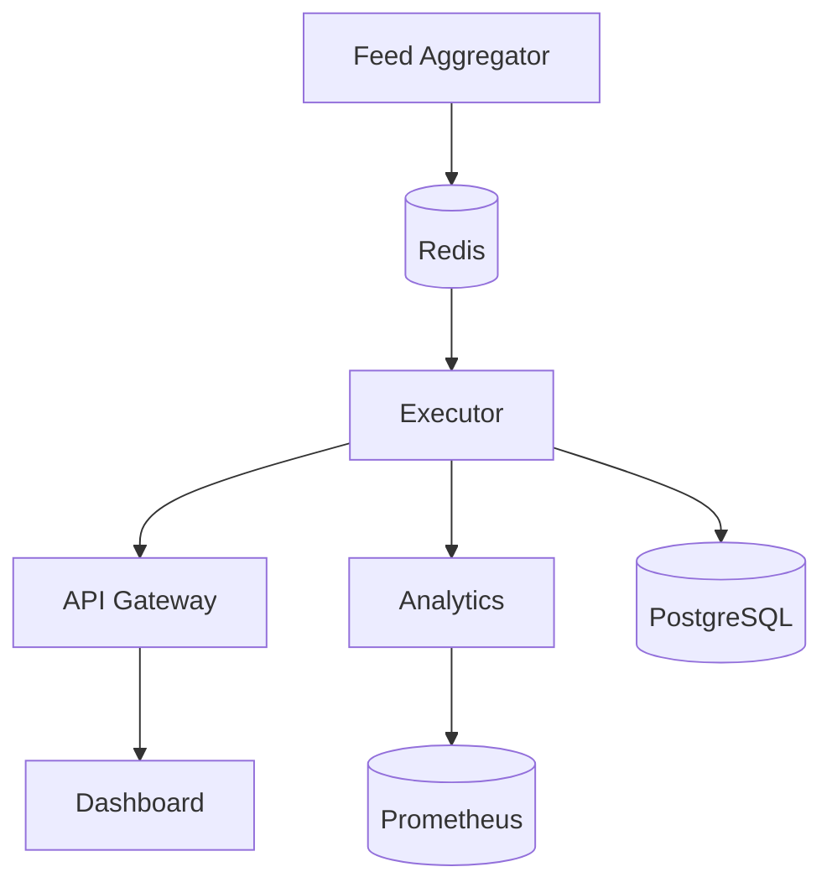

# 🪙 Crypto Arbitrage


---

## Overview

**Crypto Arbitrage** is an audited multi-agent platform that scans multiple exchanges and executes trades automatically. A feed aggregator publishes order books to Redis, a Java executor reacts to spreads, and supporting services expose APIs, analytics, and a responsive operator dashboard. Running in `sandbox` mode performs every action except fund movement so strategies can be tested safely.

---

## Features

- WebSocket feed aggregation across 14 venues
- Sub‑60µs Java trade executor
- REST API secured by JWTs and an admin token
- React dashboard with mode toggle, loss cap control, and panic resume
- Predictive analytics with optional GPU acceleration
- SealedSecrets for production credentials
- Dry‑run logs marked with `[DRY-RUN]`

---

## Architecture


```mermaid
graph TD
  FeedAggregator[Feed Aggregator] --> Redis[(Redis)]
  Redis --> Executor[Executor]
  Executor --> API[API Gateway]
  API --> Dashboard
  Executor --> Analytics
  Analytics --> Prometheus[(Prometheus)]
  Executor --> Postgres[(PostgreSQL)]
```

---

## Required Tools

- **Node.js 20** and `npm`
- **Python 3.10** and `pytest`
- **Java 17** and `gradle`
- **Podman** with **Colima** on macOS
- **Helm** and `kubectl` for Kubernetes

Enable git hooks once by running:
```bash
git config core.hooksPath githooks
```
This installs the `githooks/pre-push` script so pushes are blocked when tests fail.
Branch protection rules require the CI checks to succeed before merging.

---

## Deployment Phases

### Phase 1 – Local Dry‑Run (Colima)

1. Start Colima with Kubernetes support:
   ```bash
   colima start --with-kubernetes --runtime containerd
   ```
2. Clone the repo and install dependencies:
   ```bash
   git clone https://github.com/prism-arbitrage/crypto-arbitrage.git
   cd crypto-arbitrage
   npm install
   npm install --prefix api
   npm install --prefix dashboard
   pip install -r requirements.txt
   helm dependency update infra/helm
   ```
3. Copy environment samples and edit for dry‑run:
   ```bash
   cp api/.env.example api/.env
   cp dashboard/.env.example dashboard/.env
   cp executor/.env.example executor/.env
   cp analytics/.env.example analytics/.env
   ```
   All defaults are safe for sandbox testing.
4. Deploy the stack locally:
   ```bash
   helm install prism ./infra/helm
   ```
5. Verify pods and open the dashboard at <http://localhost:3000>.

### Phase 2 – Proxmox Server Deploy

1. Provision an Ubuntu 22.04 VM in Proxmox (10 cores, 32 GB RAM).
2. Install Kubernetes, Helm and the SealedSecrets controller on the VM.
3. Clone the repo on the VM and create sealed secrets for all `.env` files.
4. Deploy with Helm:
   ```bash
   helm install prism ./infra/helm
   ```
5. Expose the dashboard via ingress or port‑forward and confirm login works.

### Phase 3 – Post‑Deploy Validation

1. Confirm all pods show `Running`:
   ```bash
   kubectl get pods
   ```
2. Ensure the NVIDIA device plugin reports a GPU if one is present.
3. Trigger a panic test to verify alerts:
   ```bash
   curl -X POST http://localhost:8080/api/test/panic
   ```
   ⚠️ **Test endpoints operate only in sandbox mode.**
4. Use the dashboard **Resume Trading** button to clear the panic state and check logs for `[RESUME SIGNAL RECEIVED]`.
5. Validate Prometheus and Grafana dashboards if installed.

---

## Environment & Secrets

Never commit plain `.env` files. Use [SealedSecrets](https://github.com/bitnami-labs/sealed-secrets) to encrypt credentials:
```bash
kubectl create secret generic api-secrets --from-env-file=api/.env \
  --dry-run=client -o yaml > secret.yaml
kubeseal < secret.yaml > sealed-api.yaml
kubectl apply -f sealed-api.yaml
```

---

## Testing

Run all mocked tests locally:
```bash
./test/run-local.sh
```

---

## System Documentation

Additional guides are located in the [`docs/`](docs/) directory, including [dashboard instructions](docs/dashboard.md), [SMTP setup](docs/smtp_setup.md), and [Telegram setup](docs/telegram_setup.md).

## Monitoring Access

To view platform metrics locally:

```bash
kubectl port-forward svc/prometheus-server 9090:9090
kubectl port-forward svc/grafana 3001:3000
```

- Prometheus scrape endpoint: <http://localhost:9090/metrics>
- Grafana: <http://localhost:3001> (default `admin`/`admin`)

## License

Released under the [MIT](LICENSE) license.
