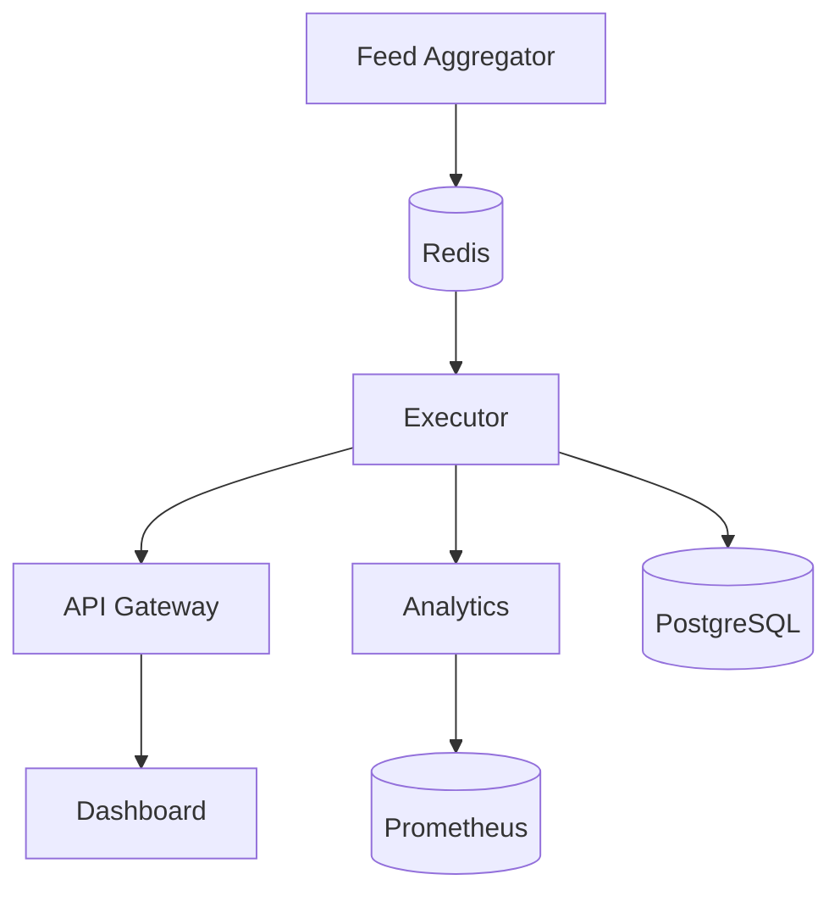

# 🪙 Crypto Arbitrage


---

## Overview

**Crypto Arbitrage** is an audited multi-agent platform that executes cross-exchange trades.  A feed aggregator publishes order books to Redis, a Java executor reacts to spreads, and supporting services expose APIs, analytics, and a real‑time operator dashboard.  The system can run in `live` or `sandbox` mode on the same host.  Sandbox mode performs every action except fund movement so strategies can be tested safely.

For a guided sandbox walkthrough see [docs/sandbox.md](docs/sandbox.md).

---

## Features

- WebSocket feed aggregation across 14 venues
- Sub‑60µs Java trade executor
- REST API secured by JWTs and an admin token
- React dashboard with persistent system status banner
- Predictive analytics with optional GPU acceleration
- Panic brake halts trading on loss, latency, or win‑rate breaches
- Resume only succeeds when heartbeat checks pass and the cold sweeper is idle
- Mode specific Redis channels `control-feed-live` and `control-feed-sandbox`
- Dry‑run behavior via `ExecutionMode.SANDBOX` with logs like `[DRY-RUN] Skipping cold wallet transfer`
- Container builds produce SBOMs and are scanned by Trivy during CI

---

## Architecture


```mermaid
graph TD
  FeedAggregator[Feed Aggregator] --> Redis[(Redis)]
  Redis --> Executor[Executor]
  Executor --> API[API Gateway]
  API --> Dashboard
  Executor --> Analytics
  Analytics --> Prometheus[(Prometheus)]
  Executor --> Postgres[(PostgreSQL)]
```

## Folder Structure

- `api/` – Fastify API server
- `dashboard/` – React frontend
- `analytics/` – Python ML service
- `executor/` – Java trading engine
- `feed-aggregator/` – order book collector
- `scripts/` – CLI helpers and ops tools
- `infra/` – Kubernetes Helm charts

---

## Required Tools

The git hooks run tests across all languages. Install the following before contributing:

- **Node.js 20** and `npm`
- **Python 3.10** and `pytest`
- **Java 17** and `gradle`
- **Podman** for container builds
- **Helm** and `kubectl` for Kubernetes

Enable the hooks once by running:

```bash
git config core.hooksPath githooks
```

---

## Dev Setup

1. Start the local container runtime:
   ```bash
   colima start --runtime podman
   ```
2. Install dependencies and charts:
   ```bash
   npm install
   npm install --prefix api
   npm install --prefix dashboard
   pip install -r requirements.txt
   helm dependency update infra/helm
   helm install arb infra/helm
   ```
3. Copy any `*.env.example` file to `.env` and adjust for your environment.  For demos, create `.env.sandbox` and run `./scripts/start-sandbox.sh`.

---

## Environment & Secrets

All production credentials are stored as SealedSecrets.  Never commit plain `.env` files.  `test/verify-env.sh` fails if unsealed secrets or `.env.sandbox` exist in the repository.

To seal a new secret:

```bash
kubectl create secret generic api-keys --from-literal=API_KEY=abc123 \
  --dry-run=client -o yaml > secret.yaml
kubeseal < secret.yaml > sealed-secret.yaml
```

Commit the sealed file and apply it during deployment:

```bash
kubectl apply -f sealed-secret.yaml
```

---

## Running Tests

Run all mocked tests locally:
```bash
./test/run-local.sh
```
For the optional live dry‑run suite:
```bash
./test/run-live.sh
```

Individual service tests can be run with `npm test`, `pytest`, or `./gradlew test`.

---

## Continuous Integration

GitHub Actions enforces safety gates:

1. `test/verify-env.sh` blocks plaintext secrets or unsealed manifests.
2. Each service runs unit tests and ESLint/flake8 checks.
3. Containers build with Podman and are scanned by Trivy.
4. Kubernetes manifests are validated with kubeconform and a dry‑run apply.
5. All Actions are pinned to commit SHAs for reproducibility.

Run `bash test/verify-env.sh` before pushing to mirror the CI checks.

---

## Live Trade Simulation

Enable ghost mode in settings or run:
```bash
node scripts/mock-ghost-feed.js --pair BTC-USD
```
Trades stream through Redis and appear on the dashboard.  Disable ghost mode for real trading.

---

## Monitoring

- **Sentry** captures runtime exceptions.
- **Prometheus** scrapes `/metrics/live` or `/metrics/sandbox`.
- **StatusCake** monitors public endpoints using the API token and contact group defined in `.env.example`.

Port‑forward services locally to inspect metrics:
```bash
kubectl -n arbitrage port-forward svc/api 9100:8080 &
kubectl -n arbitrage port-forward svc/executor 9200:9100 &
kubectl -n arbitrage port-forward svc/analytics 9300:5000 &

curl http://localhost:9100/api/metrics/live
curl http://localhost:9100/api/metrics/sandbox
curl http://localhost:9200/metrics
curl http://localhost:9300/metrics
```

---

## ML Training Pipeline

1. Export features:
   ```bash
   python analytics/train/export_features.py
   ```
2. Retrain the LSTM model:
   ```bash
   python analytics/train/retrain.py --epochs 10
   ```
3. Swap to a previous model if required:
   ```bash
   python analytics/model_swap.py --version <hash>
   ```

Model versions are stored in `analytics/models/archive` and tracked via SHA256 hashes.

---

## Deployment

Deploy or upgrade services using Helm:
```bash
./scripts/ops-tools.sh start
```
Check pod status:
```bash
./scripts/ops-tools.sh status
```

See [docs/ops/helm-rollback-guide.MD](docs/ops/helm-rollback-guide.MD) for rollback instructions.

---

## System Documentation

Additional architecture, strategy, and operations guides are in the [`docs/`](docs/) directory.

## License

Released under the [MIT](LICENSE) license.
