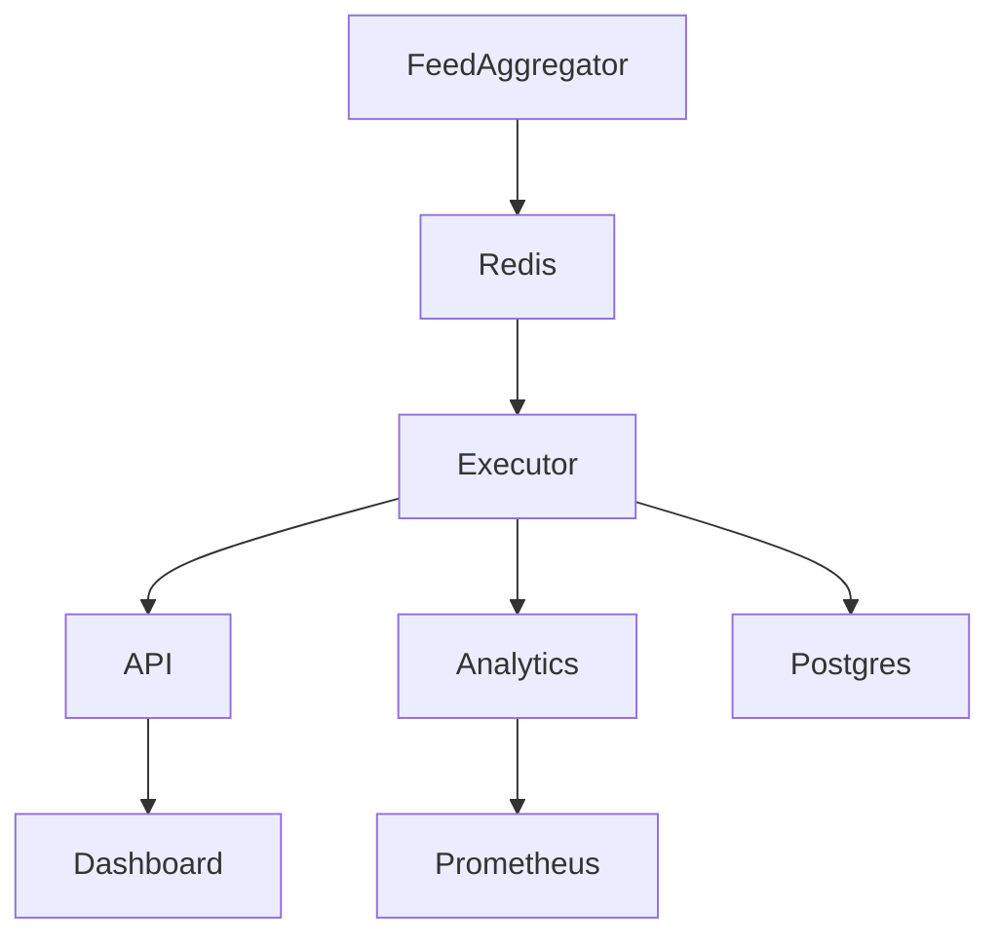

# architecture.md

## Components

- **Feed Aggregator** – collects order books from multiple exchanges and publishes normalized data to Redis.
- **Executor** – a Java service that evaluates spreads and submits orders with sub‑60µs latency.
- **API Gateway** – Fastify server that exposes REST endpoints and serves the React dashboard.
- **Analytics** – Python service providing predictive models and metrics.
- **Rebalancer** – moves capital between venues and sweeps profits to cold storage.
- **Dashboard** – React SPA for monitoring and control.

Redis and Postgres provide messaging and durable storage while Prometheus and Grafana handle observability.

## Data Flow

Each component runs in its own container and communicates over the internal network. Secrets are injected using sealed secrets during deployment.
